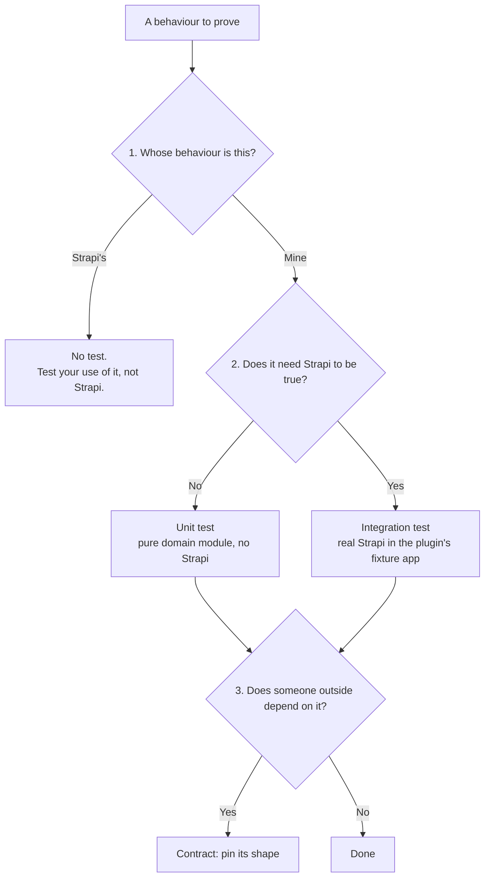
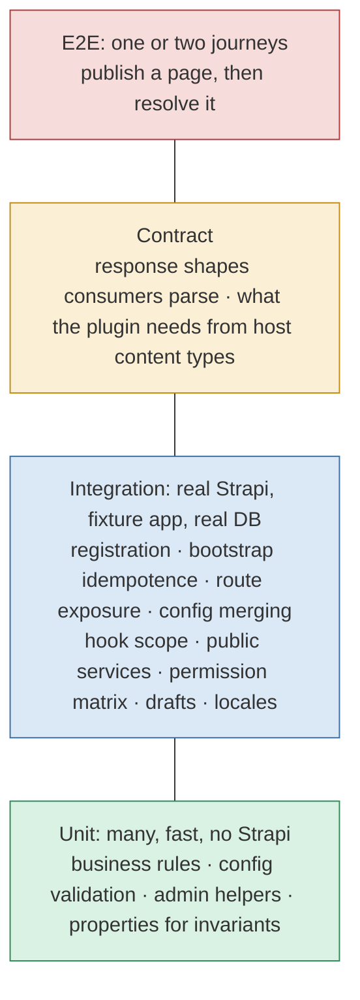
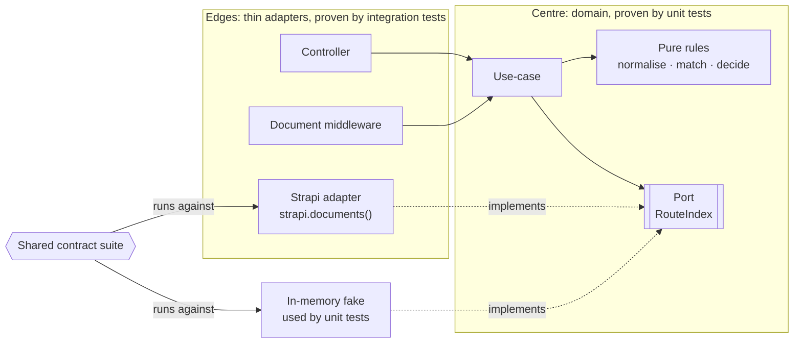
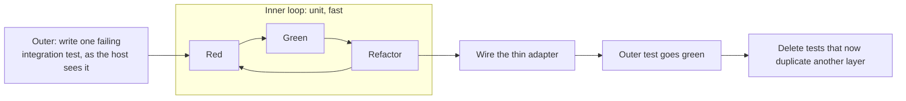

# strapi-skills

A Claude Code plugin bundle for building **Strapi v5 plugins** with agents: how to write
the plugin, how to build its admin UI, and how to test it at the right level.

| Skill | What it does |
|---|---|
| `strapi-plugin-dev` | Plugin development: Document Service API, factory patterns, routes and RBAC, admin extensions, RHF + Zod, TanStack Query v5 |
| `strapi-ui-design` | Admin UI with Design System v2: layouts, tables, forms, modals, accessibility, a source-derived catalog of 46 components |
| `strapi-plugin-testing` | Testing at the right level: unit for logic, real Strapi for data behaviour, contracts for consumers |

The bundle also ships:

- **Agents**: `strapi-reviewer` (v5 conformance of `server/src` and `admin/src`) and
  `strapi-ui-reviewer` (Design System v2 conformance).
- **Commands**: `/strapi-skills:scaffold-plugin`, `add-content-type`, `add-cm-panel`,
  `verify`, `ui-component`, `ui-audit`.
- **Hooks**: after each edit, checks for v5 server anti-patterns, invalid content-type
  schemas and Design System violations in `admin/src/**/*.tsx`, plus Strapi context
  injected into prompts.

## Install

In Claude Code:

```
/plugin marketplace add ayhid/strapi-plugin-testing
/plugin install strapi-skills@strapi-skills
```

The rest of this page covers the newest skill, `strapi-plugin-testing`.

---

## strapi-plugin-testing

Makes coding agents test Strapi v5 plugins at the right level: fast and isolated where the
logic lives, against a real Strapi where the framework is involved. It adapts the
[Practical Test Pyramid](https://martinfowler.com/articles/practical-test-pyramid.html)
to plugins built by agents.

> **Put logic where it can be tested without Strapi, test your use of Strapi against a
> real Strapi, and treat everything others depend on as a promise.**

## Why

Agents optimise for green tests, not true ones. Typical drifts:

- mocking `strapi.documents().findMany` so filters, drafts and locales "work"
- tests that mirror the implementation (`toHaveBeenCalledWith({ filters: … })`)
- business logic in controllers, services and lifecycles
- skipping the integration layer because it is slow
- the same case proven at unit, integration *and* E2E

The skill gives the agent a way to decide where each test belongs, and what it may fake.

## The three questions

Every piece of code gets asked three questions:



If the honest answer to question 2 is "yes" for most of a feature, the logic is in the
wrong place: extract it before writing tests.

## Layers



Each case is proven **once**, at the lowest layer that can observe the failure. A bug
caught high means a test missing low.

## Framework at the edges, logic in the centre

Controllers, services, lifecycles and document middlewares stay thin adapters. Decisions
live in framework-free domain modules. Data access goes through a small **port** the
plugin owns, and the fake used in unit tests is kept honest by running **the same
contract suite** against the real Strapi adapter.



What may be faked in a unit test:

| Fake it | Never fake it |
|---|---|
| Plugin config, logger | `strapi.documents()`, `strapi.db.query()` |
| Your own services, via a port | Filters, populate, sorting, pagination |
| A port you own, *if* its contract suite runs on the real adapter too | Draft & publish, locales |
| Third-party APIs, at your own wrapper | Permissions, policies, whether a hook fires |

## Double-loop TDD



## Repository layout

```
.claude-plugin/
├── plugin.json                       # the strapi-skills plugin
└── marketplace.json                  # lets this repo be added as a marketplace
skills/
├── strapi-plugin-dev/                # SKILL.md, patterns.md, examples.md
├── strapi-ui-design/                 # SKILL.md, patterns.md, examples.md, component-catalog.md
└── strapi-plugin-testing/
    ├── SKILL.md                      # core: three questions, design rules, workflow, rules package
    └── references/
        ├── layers-and-mocking.md     # what each layer owns, where mocks lie, shared fake Strapi, ports
        ├── plugin-specifics.md       # register, bootstrap, config, routes, hooks, fixture app, harness
        ├── double-loop-tdd.md        # outer/inner loops, test-first vs test-with
        ├── property-based-testing.md # good invariants, stateful pattern, traps
        ├── review-checklist.md       # judgment rules for reviewing agent output
        └── planning-template.md      # each behaviour declares its layer and proving test
agents/                               # strapi-reviewer, strapi-ui-reviewer
commands/                             # scaffold-plugin, add-content-type, add-cm-panel, verify, ui-component, ui-audit
hooks/hooks.json                      # edit-time checks and context injection
scripts/                              # the hook scripts
evals/strapi-plugin-testing/          # test prompts and input fixtures used to validate the testing skill
```

Each `SKILL.md` stays short and loads when its description matches the task. The agent
opens reference files only when the task needs them. The testing skill triggers on
planning, implementing, testing or reviewing plugin code, and stays out of Strapi
content-modelling questions and frontend-only work.

## Early results

Three tasks, each run by an agent with the skill and without it:

| Task | With skill | Without |
|---|---|---|
| Plan a route-resolution feature | 8/8 | 8/8 |
| Add wildcard redirects, code and tests | 6/6 | 2/6 |
| Review a test file seeded with drifts | 7/7 | 5/7 |

Without the skill, the wildcard task kept the precedence logic in the controller, faked
`findMany` with a filter-interpreting mock, extended a call-sequence assertion and never
booted Strapi. With it, the logic moved to pure modules behind a port, with a fixture app,
real-Strapi integration tests and properties for precedence. The planning task doesn't
separate the two yet; its checks will be tightened.

## Status

V1 draft. Planned next:

- **Triggering validation**: a prompt set on both sides, so the skill loads on plugin work and stays quiet otherwise.
- **Rules package**: three deterministic checks run with one command. They are *domain is
  framework-free*, *units stay units* and *changes come with tests*. The skill already
  tells agents to run it.
- **Stop hook**: a Claude Code adapter that calls the rules package, fail-closed.
- **Pilot**: one feature shipped by agents with the skill and hook, plus a drift log.
