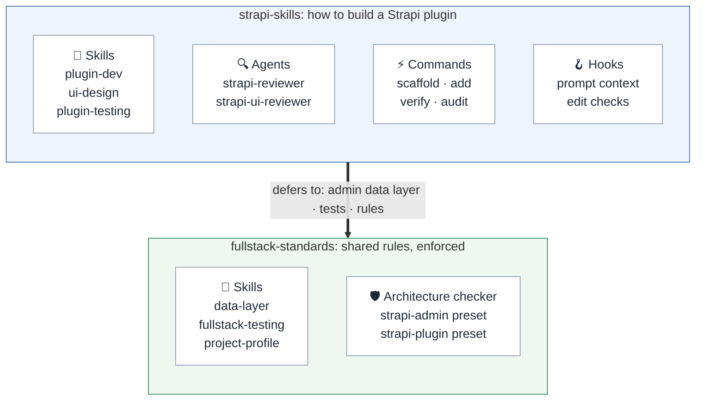
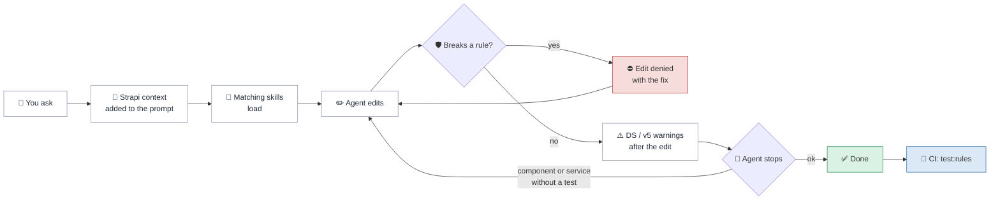
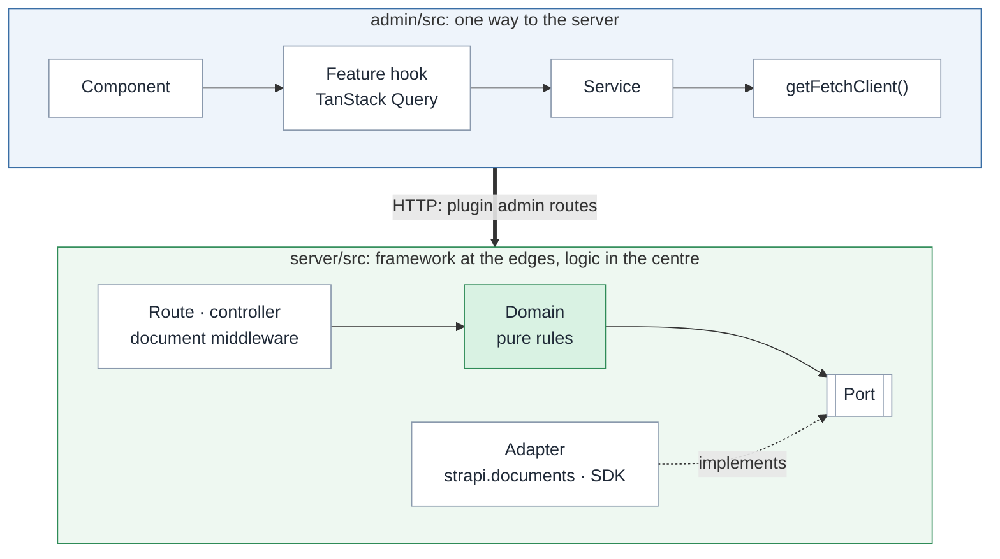
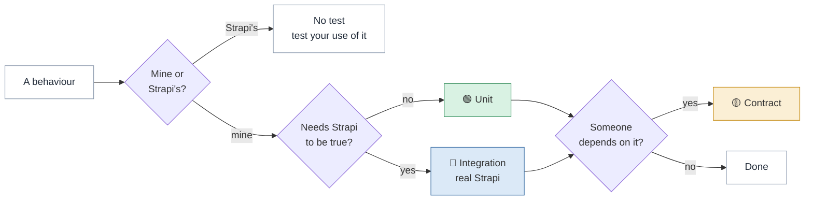

# strapi-skills

**Build Strapi v5 plugins with coding agents that write the right code and prove it with the right tests.**

A Claude Code plugin: three skills, two reviewer agents, six slash commands and edit-time
checks. Paired with [fullstack-standards](https://github.com/ayhid/fullstack-standards), it
turns good practice into rules the agent cannot skip.

Checked against Strapi 5.56 (`@strapi/strapi` 5.56.0, Node `>=20 <=26`, React 18), Design
System and icons 2.2.4, and `@strapi/sdk-plugin` 6.1.1.

- [The goal](#the-goal)
- [Why it is useful](#why-it-is-useful)
- [What is in the box](#what-is-in-the-box)
- [Install](#install)
- [How to use it](#how-to-use-it)
- [What it adds to your workflow](#what-it-adds-to-your-workflow)
- [How a plugin is shaped](#how-a-plugin-is-shaped)
- [How it tests](#how-it-tests)
- [Results](#results)
- [Repository layout](#repository-layout)

---

## The goal

Agents write plugin code fast, but left alone they guess. They reach for Strapi v4 APIs,
build admin screens out of raw HTML, fetch data straight from components, and write tests
that pass without proving anything.

This bundle gives the agent the knowledge to get it right first time, and the checks to
catch it when it doesn't:

> **Current Strapi v5 APIs on the server, Design System v2 in the admin, logic where it can
> be tested without Strapi, and every behaviour proven once, at the lowest layer that can
> see it fail.**

## Why it is useful

| Without it, agents tend to… | With it, they… |
|---|---|
| Use `strapi.entityService` and v4 patterns | Use the Document Service API and v5 factories |
| Build admin UI with `<button>`, `styled-components`, `alert()` | Use Design System v2 compound components |
| Call `useFetchClient` and `useQuery` inside components | Layer the admin: component → hook → service → `getFetchClient()` |
| Mock `strapi.documents().findMany` so filters "work" | Test data behaviour against a real Strapi |
| Leave business logic in controllers | Move decisions into pure domain modules |
| `jest.mock` the Brevo or Stripe SDK | Put the provider behind a port and fake the port |
| Test hooks with `renderHook` | Render the component, with its service mocked |
| Stop when the tests are green | Can't stop while a changed component or service has no test |

## What is in the box



| Skill | Loads when you… | Teaches |
|---|---|---|
| `strapi-plugin-dev` | build or change plugin code | Document Service API, factories, routes and RBAC, admin extensions, RHF + Zod, the layered admin data layer |
| `strapi-ui-design` | work on `admin/src` screens | Design System v2 layouts, tables, forms, modals, accessibility; a catalog of 46 components taken from the DS source |
| `strapi-plugin-testing` | plan, write, fix or review tests | Which layer each test belongs to, what may be faked, the fixture app and harness |

The skills load on their own when the task matches; you don't have to name them.

## Install

**1. Add both plugins** (in Claude Code):

```
/plugin marketplace add ayhid/strapi-skills
/plugin install strapi-skills@strapi-skills

/plugin marketplace add ayhid/fullstack-standards
/plugin install fullstack-standards@fullstack-standards
```

**2. Turn the checks on in your plugin repo.** This writes `.claude/fullstack-standards.json`:

| Your situation | Do this |
|---|---|
| New plugin | `/strapi-skills:scaffold-plugin my-plugin` (writes it for you) |
| Existing plugin | Ask the agent to *"create the project profile"*. The `project-profile` skill detects the plugin, writes the config and an `AGENTS.md` profile |

The config is two lines:

```json
{
  "frontends": [{ "root": "admin/src", "preset": "strapi-admin" }],
  "apis": [{ "root": ".", "preset": "strapi-plugin" }]
}
```

**3. Run the same checks in CI** (the scaffold adds this script):

```json
"scripts": { "test:rules": "fullstack-standards --all ." },
"devDependencies": { "fullstack-standards": "github:ayhid/fullstack-standards#v1.0.0-beta.2" }
```

## How to use it

Mostly, just ask for what you want. The skills and hooks do the rest. For common jobs, use
a command:

| You want to… | Run |
|---|---|
| Start a new plugin | `/strapi-skills:scaffold-plugin <name>` |
| Add a content type (schema, service, controller, routes) | `/strapi-skills:add-content-type <singular-name>` |
| Add a Content Manager side panel | `/strapi-skills:add-cm-panel <PanelName>` |
| Add an admin screen | `/strapi-skills:ui-component <settings\|table\|form\|modal\|dashboard> [name]` |
| Check the whole plugin before a PR | `/strapi-skills:verify` |
| Check the admin against the Design System | `/strapi-skills:ui-audit` |

To review code, ask for it: *"review the plugin with the strapi-reviewer agent"* (v5
conformance, layering, tests) or *"…with strapi-ui-reviewer"* (Design System v2,
accessibility).

Example prompts that pull in the right skill:

- *"Add wildcard support to the redirects matcher, with tests."*
- *"Email the site owner through Brevo when a redirect is created."*
- *"Plan the route-resolution phase, with the layer each test sits at."*
- *"Why does this integration test pass when drafts are returned?"*

## What it adds to your workflow

Every step of a session gets a check, and CI repeats the deterministic ones:



| Moment | What runs | From |
|---|---|---|
| You send a prompt | Strapi v5 context is added; you're told if the checks are off | strapi-skills |
| Before an edit | Layering, domain, unit-test and SDK rules; a violation **denies** the edit | fullstack-standards |
| After an edit | Strapi v5 server, schema and Design System checks (feedback to the agent) | strapi-skills |
| Before the agent stops | Each changed component has a render test, each service a test; otherwise it **must continue** | fullstack-standards |
| On push | `npm run test:rules` | fullstack-standards |

<details>
<summary>The rules the checker enforces</summary>

| Rule | Means |
|---|---|
| `component-imports`, `component-data-hooks` | Components call feature hooks only: no `getFetchClient`, `useFetchClient`, `useQuery` or `useMutation` |
| `hook-imports`, `client-importers` | Only services call `getFetchClient()` |
| `component-test`, `service-test` | Every component has a test that renders it, every service a test that imports it |
| `no-render-hook`, `no-hook-tests` | Hooks are tested through components, never alone |
| `no-fetch` | No raw `fetch` or `axios` |
| `domain-framework-free` | `server/src/domain/**` never imports `@strapi/*` or touches `strapi` |
| `unit-stays-unit` | `tests/unit/**` never imports the harness or `@strapi/strapi`, never calls `createStrapi` |
| `no-fake-data-access` | No unit test fakes `documents`, `db` or `entityService` |
| `sdk-importers`, `no-sdk-in-specs` | Provider SDKs only in `*.adapter.ts`; never mocked in tests |

Existing debt can be recorded once as a baseline, which can only shrink.
</details>

## How a plugin is shaped



- **Admin:** each layer calls only the next one. Query keys come from one factory, and
  every tree (plugin pages *and* Content Manager panels) shares one `queryClient`.
  Details: [`skills/strapi-plugin-dev/fullstack-standards.md`](skills/strapi-plugin-dev/fullstack-standards.md).
- **Server:** controllers, services and middlewares stay thin. Decisions live in
  `domain/`, which never imports Strapi. Data and third-party services sit behind ports
  the plugin owns.

## How it tests

> **Put logic where it can be tested without Strapi, test your use of Strapi against a
> real Strapi, and treat everything others depend on as a promise.**

Three questions decide where each test goes:



If question 2 is "yes" for most of a feature, the logic is in the wrong place: extract it
first.

| Layer | Proves | How many |
|---|---|---|
| 🟢 **Unit** | Business rules, config validation, admin components (service mocked), services (`getFetchClient` mocked) | Many, fast |
| 🔵 **Integration** | Registration, bootstrap, routes, permissions, drafts, locales, hook scope: anything data-shaped, in the plugin's fixture app | Some |
| 🟡 **Contract** | Response shapes consumers parse; what the plugin needs from host content types | Few |
| 🔴 **E2E** | One whole journey | 1–2 |

Each case is proven **once**, at the lowest layer that can see it fail. A bug caught high
means a test is missing low.

| Fake it | Never fake it |
|---|---|
| Plugin config, logger | `strapi.documents()`, `strapi.db.query()` |
| A port you own, *if* its contract suite also runs on the real adapter | Filters, populate, sorting, pagination |
| A third-party service, at its port | Draft & publish, locales |
| The feature service, in a component test | Permissions, policies, whether a hook fires |

New features run **double-loop**: one failing integration test from the host's point of
view, then red-green-refactor unit tests inside it, then the thin adapter that turns the
outer test green.

## Results

The same tasks, run by an agent with the skills and without them (one run each, graded
against fixed assertions; `evals/strapi-plugin-testing/evals.json`):

| Task | With | Without |
|---|---|---|
| Plan a route-resolution feature | 8/8 | 8/8 |
| Add wildcard redirects, code and tests | 6/6 | 2/6 |
| Review a test file seeded with drifts | 7/7 | 5/7 |
| Add a Content Manager side panel with tests | 8/8 | 2/8 |
| Email the owner through Brevo on create | 7/7 | 2/7 |

Without the skills, agents kept matching logic in the controller, faked `findMany`, called
`useFetchClient` from hooks, tested hooks with `renderHook`, and `jest.mock`ed the Brevo
SDK with no integration test. With them: pure domain modules behind ports, a fixture app
with real-Strapi integration tests, a layered admin, and zero findings from the checker.

## Repository layout

<details>
<summary>Show the tree</summary>

```
.claude-plugin/                     # plugin.json, marketplace.json
skills/
├── strapi-plugin-dev/              # SKILL.md, patterns.md, examples.md, fullstack-standards.md
├── strapi-ui-design/               # SKILL.md, patterns.md, examples.md, component-catalog.md
└── strapi-plugin-testing/
    ├── SKILL.md                    # three questions, design rules, workflow, rules package
    └── references/                 # layers and mocking, plugin specifics, double-loop TDD,
                                    # property-based testing, review checklist, planning template
agents/                             # strapi-reviewer, strapi-ui-reviewer
commands/                           # scaffold-plugin, add-content-type, add-cm-panel, verify, ui-component, ui-audit
hooks/hooks.json                    # prompt context and edit-time checks
scripts/                            # the hook scripts
evals/strapi-plugin-testing/        # eval prompts and input fixtures
```

Each `SKILL.md` stays short; reference files open only when the task needs them.
</details>

## Status

Working and in use. Next:

- **Triggering checks:** a prompt set confirming each skill loads on plugin work and stays
  quiet otherwise.
- **More eval runs:** several runs per task, to measure variance.
- **Pilot:** one feature shipped end to end with the skills and checks, with a log of what
  still drifts.

MIT licensed.
